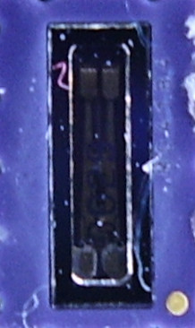

RTC RV-3029-C2 Arduino Library
========================================

The Micro Crystal RV-3029-C2 is a low power, real-time clock/calendar module with built-in
Thermometer and Digital Temperature Compensation circuitry (DTCXO).

[*Application Manual*](https://www.microcrystal.com/fileadmin/Media/Products/RTC/App.Manual/RV-3029-C2_App-Manual.pdf)

This library is based in part on Constantin Koch's RTC RV-3028-C7 Arduino
Library (https://github.com/constiko/RV-3028_C7-Arduino_Library), which was
originally forked from the [Sparkfun RV-1805
library](https://github.com/sparkfun/SparkFun_RV-1805_Arduino_Library), and
costumized and enhanced to the RV-3028-C7. As well as adapting the library
to the capabilities of the RV-3029-C2, the API was cleaned up a bit, and
support for reading/writing RTC and alarm date/time in "struct tm" format was
added.

This library allows the user to:

* Set time using hard numbers or the BUILD_TIME from the Arduino compiler
* Read time
* Configure various aspects of the RTC including setting of alarms, countdown timer, trickle charging, and programmable clock output.

Examples are included to get you started.

Repository Contents
-------------------

* **/examples** - Example sketches for the library (.ino). Run these from the Arduino IDE.
* **/src** - Source files for the library (.cpp, .h).
* **keywords.txt** - Keywords from this library that will be highlighted in the Arduino IDE.
* **library.properties** - General library properties for the Arduino package manager.

Documentation
--------------
The library enables the following functions:

### General functions
    bool begin(TwoWire &wirePort = Wire);

Initialize library and read time from RTC. 
Please call begin() sometime after initializing the I2C interface with Wire.begin().

### Status
    bool isValid()K { return time_valid; }
Check if a valid time is available.	

### Set Time
    bool setTime(struct tm *newtime);
    bool setTime(uint8_t sec, uint8_t min, uint8_t hour, uint8_t day, uint8_t month, uint16_t year);
    setToCompilerTime()

### Get Time
Please call "updateTime()" before calling one of the other getTime
functions. The library keeps track if the internal time is valid - either by
reading from the RTC without error, or by setting a new time. After a
backup battery power loss, RTC time is deemed invalid until a new time is set.

    bool updateTime(struct tm *cur = 0);
    getSeconds()
    getMinutes()
    getHours()
    getWeekday()
    getDay()
    getMonth()
    getYear()
    stringDateUSA()
    stringDate()
    stringTime()
    stringTimeStamp()

### Alarm
    bool setAlarm(struct tm &newtime, AlarmFlags which);
    bool setAlarm(uint8_t sec, uint8_t min, uint8_t hour, uint8_t day, uint8_t month, uint16_t year, AlarmFlags which);
    enableAlarmInterrupt()
    disableAlarmInterrupt()
    readAlarmInterruptFlag()
    clearAlarmInterruptFlag()

The AlarmFlags parameter is a bitmask that specifies which values shall be compared when causing an alarm interrupt:

    enum AlarmFlags {
      AL_NONE = 0x00,
      AL_SEC = 0x01,  // seconds
      AL_MIN = 0x02,  // minutes
      AL_HOUR = 0x04, // hours
      AL_DAY = 0x08,  // day of month
      AL_WDAY = 0x10, // weekday
      AL_MON = 0x20,  // month
      AL_YEAR = 0x40  // year
    };

Note: the weekday register in the RTC is automatically calculated when
setting time/alarm. Thus, to set a specific weekday for an alarm, you have
to pass in a complete date that matches that weekday.

### Countdown Timer
    bool setTimer(bool timer_repeat, TimerFreq timer_frequency, uint16_t timer_value, bool setInterrupt, bool start_timer);
    void enableTimer();
    void disableTimer();
    void enableTimerInterrupt();
    void disableTimerInterrupt();
    bool readTimerInterruptFlag();
    void clearTimerInterruptFlag();

`timer_repeat_`  specifies either Single or Repeat Mode for the Periodic Countdown Timer.

Countdown Period [s] = Timer Value / Timer Frequency

### Trickle Charge Settings
    bool enableTrickleCharge(TrickleCharge tcr = TrickleCharge::TCR_80K);
    bool disableTrickleCharge();

    enum class TrickleCharge {
      TCR_80K,
      TCR_20K,
      TCR_5K,
      TCR_1K
    };

The trickle charge setting is saved to EEPROM, thus it needs to be set only
once.

### Programmable Clock Output

    bool enableClockOut(ClkOutFreq freq);
    void disableClockOut();

    enum class ClkOutFreq {
      CLK_1HZ,
      CLK_32HZ,
      CLK_1024HZ,
      CLK_32768HZ
    };

The clock output frequency is saved to EEPROM, thus it needs to be set only once.

### Misc

    int getTemperature();
return temperature in °C

    void dumpRegisters();
dump RTC registers to stdout.

License Information
-------------------

This product is _**open source**_!

Please review the LICENSE.md file for license information.

Distributed as-is; no warranty is given.
